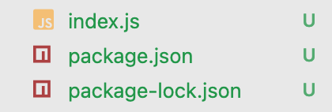

Welcome back!

I thought I would write another mini-series about a topic that I gave me trouble long ago and I now enjoy and understand really well. The topic is Redux and despite the things you might have heard it's a lot of fun...or I've been hit in the head by a welding mallet, only time will tell. Plus we're all in this together anyway.


In this series, I want to go over the who, what, and why of Redux as a tool, separate from React, and then go over the popular combination of React and Redux.

Let's get started!

# Who is Redux and What Can It Do?

As mentioned in the introduction, I'm going to go over Redux as a separate tool away from React because Redux can be used with any JavaScript framework, including plain vanilla JavaScript.

If you google "What is Redux?" you will receive along answer and it's history. It's a nice read, but not necessary. To simply explain what it is: Redux is a tool that makes an engineer's job easier. It help manage our state and keeps our code clean manageable by making state a separate object outside of an application. This separate state object is an _immutable_ tree which can't be changed directly.

If you have used React's `useState` hook and/or class components in applications before, than you understand how difficult it can be for state to be managed. Sometimes, we can may not be passing state "high enough" in our component tree which causes a lot of frustration in our refactoring.

# Why and When Should You Use Redux?

We went over what Redux can do in the previous section and that should also give you ideas on why you should use it. However, answering the question of when to use Redux will help influence why you should use it. When states becomes too unmanageable and to keep your code clean, you should use Redux.

**Note:** Not every application needs to use Redux.... For example, a hammer is a great tool for a lot of home improvement projects, but not every home improvement project requires a hammer.

# Redux in Action

Let's go step-by-step

## Setup

Open up your preferred IDE text editor and create a new folder with a name of your choosing and create a new file called `index.js`.

Next, we're going to run the terminal command `npm i redux --save`, this should created both `package.json` and `package-lock.json` files.



At the top of our `index.js` file, we need to import `redux` into our file. I'm just using ES5 syntax here, but you can use ES6.

ES5:

```jsx
const redux = require("redux");
```

(If you're used to using ES5 but want to learn how you can install ES6 and use that instead, check out this post on [Stack Overflow](https://stackoverflow.com/questions/63588714/node9374-warning-to-load-an-es-module-set-type-module).)

ES6

```jsx
import redux from 'redux
```

This next part is something I wanted to show you. When you do `console.log(redux)`, it will return:

```json
{
  __DO_NOT_USE__ActionTypes: {
    INIT: '@@redux/INITg.p.b.5.i.9',
    REPLACE: '@@redux/REPLACEe.c.z.w.8.8',
    PROBE_UNKNOWN_ACTION: [Function: PROBE_UNKNOWN_ACTION]
  },
  applyMiddleware: [Function: applyMiddleware],
  bindActionCreators: [Function: bindActionCreators],
  combineReducers: [Function: combineReducers],
  compose: [Function: compose],
  createStore: [Function: createStore]
}
```

Let's explore what each of these functions do:

(It's okay to not understand how everything is connected at this point.)

### `createStore`

`createStore` creates our Redux store and holds the complete state tree as our Single Source of Truth. It can take two arguments our combined reducer and a store enhancer (`applyMiddleware`, more on this later.).

### `combineReducers`

`combineReducers` is a function that does what the name suggests. It combines the reducer functions that return the default or new state when called. This helps keep everything. organized and clean.

### `compose`

`compose` allows us to use more than one store enhancer in our `createStore` function (sort of).

Example:

```jsx
const composeEnhancer = window.__REDUX_DEVTOOLS_EXTENSION_COMPOSE__ || compose;

const store = createStore(rootReducer, composeEnhancer(applyMiddleware(thunk)));
```

Here, I wanted to use the Google Chrome Redux Devtools extension (more on that later too when we go over React with Redux) as well as the `applyMiddleware` function. (**Note:** This is just one way to use `compose`. We will use it in another way with React as well.)

### `bindActionCreators`

`bindActionCreators` works in a similar fashion to `combineReducers`, it combines the actions that we import from an `actions` folder. We would use it in our `mapDispatchToProps` function in React.

### `applyMiddleware`

Lastly, `applyMiddleware` allows us to use other libraries and extend Redux with custom functionality. For instance, `redux-thunk` is a popular middleware that people use to make asynchronous API calls. `applyMiddleware` is a store enhancer.

# Conclusion

Hope this first part of the series was helpful!

Next week, I will go through a step-by-step tutorial using Redux in vanilla JavaScript and show you how everything works.
