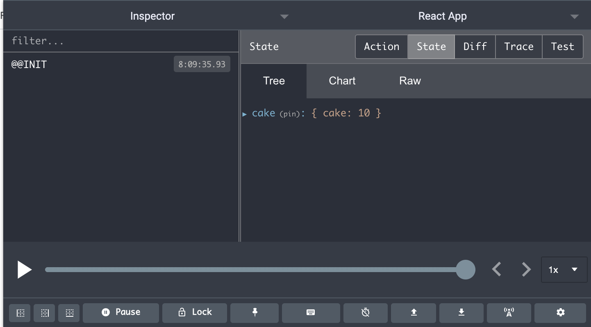

We've made it!

We're now going to implement Redux with React. Last week, we saw how we can use Redux with vanilla JavaScript.

Today, we're going to create a simple React app with Redux based on vanilla JavaScript app. Next week, I'd like to go over asynchronous API calls.

# Getting Started

First, we need to create our React app.

```bash
npx create-react-app bakery-redux-app

# npx create-react-app my-app <- name your app whatever you want
```

Next, we'll `cd` into the directory and start our sever.

```bash
cd bakery-redux-app
npm start
```

Then, we can work on creating our cake component.

Inside our `src` directory, we'll create a new folder called `Components` and create a file called `CakeComponent.js`.

Here's what I created:

```jsx
import React from "react";

const CakeComponent = () => {
  return (
    <React.Fragment>
      <div
        style={{
          backgroundColor: "#FFAFC5",
          padding: "20px",
          width: "25%"
        }}
      >
        
        <br />
        <br />
        <b>{0} Cakes</b>
        <br />
        <br />
        <button>Sell Cake</button>
        <br />
        <br />
        <button>Bake Cake</button>
        <br />
      </div>
    </React.Fragment>
  );
};

export default CakeComponent;
```

# Adding Redux

We're going to install the Redux and React-Redux libraries.

```bash
npm install redux
```

```bash
npm install react-redux
```

We're also going to create our `actions` and `reducers` folders.

## Actions

### `actions/cake-actions.js`

```jsx
export const SELL_CAKE = "SELL_CAKE";
export const BAKE_CAKE = "BAKE_CAKE";

const sellCake = () => {
  return {
    type: SELL_CAKE
  };
};

const bakeCake = () => {
  return {
    type: BAKE_CAKE
  };
};
```

In our `cake-actions` file, we start out by creating our actions types constants. And then, we can create our functions that will return our action objects with the specific type we want to use to invoke a certain behavior in our reducer functions.

## Reducers

### `reducers/cake-reducer.js`

```jsx
import { SELL_CAKE, BAKE_CAKE } from "../actions/cake-actions";

const cakeInventory = {
  cake: 10
};

const cakeReducer = (state = cakeInventory, action) => {
  switch (action.type) {
    case BAKE_CAKE:
      return {
        ...state,
        cake: state.cake + 1
      };
    case SELL_CAKE:
      return {
        ...state,
        cake: state.cake - 1
      };
    default:
      return state;
  }
};

export default cakeReducer;
```

We start by importing the action types and create our state object containing a key with a default value of 10 cakes.

Then, we create our reducer function with a switch/case statement that will invoke certain changes to the state object based on `action.type`.

### `reducers/index.js`

```jsx
import { combineReducers } from "redux";

import cake from "./cake-reducer";

export default combineReducers({
  cake
});
```

We went over this last week, but nothing changed. We imported the `combineReducers` functions from the Redux library (in case we want to import other reducers like `cake`).

## Create Our Store

```jsx
import React from "react";
import ReactDOM from "react-dom";
import "./index.css";
import App from "./App";

import rootReducer from "./reducers";

import { Provider } from "react-redux";
import { createStore } from "redux";

const store = createStore(
  rootReducer,
  window.__REDUX_DEVTOOLS_EXTENSION__ && window.__REDUX_DEVTOOLS_EXTENSION__()
);

ReactDOM.render(
  <Provider store={store}>
    <App />
  </Provider>,
  document.getElementById("root")
);
```

Inside of our `index.js` file, we need to import our `Provider` tags from the `react-redux` library as well as our `createStore` function from `redux`.

Inside our `store` variable, we use the `createStore` function and pass in our `rootReducer` function and our Redux Devtools connectivity.



**Note:** I added the ability to use the Redux Google Chrome Devtools. You can read more about it [here](https://extension.remotedev.io/), but it works similar to the regular Google Chrome Devtools. This will be helpful during projects.

## Connecting Redux to Our Component

`src/Components/CakeComponent.js`

```jsx
import React from "react";
import { connect } from "react-redux";

import { bakeCake, sellCake } from "../actions/cake-actions";

const CakeComponent = props => {
  return <React.Fragment>...</React.Fragment>;
};

const mapStateToProps = state => {
  return state.cake;
};

const mapDispatchToProps = {
  bakeCake,
  sellCake
};

export default connect(mapStateToProps, mapDispatchToProps)(CakeComponent);
```

The two imports that we need to make are for the `connect` higher order component (HOC) from the `react-redux` library as well as the actions from `cake-actions.js` file. We also create and pass in two arguments in the `connect` component, `mapStateToProps` and `mapDispatchToProps`.

**`mapStateToProps`** returns our state object that we can render in a component. It's not mandatory to use this function if you don't need to render anything from state.

**`mapDispatchToProps`** returns a dispatch function that we use to call on actions to re-render state. However, I like to use the ES6 syntax and simply pass in the actions I import via the `mapDispatchToProps` object.

# Bringing It All Together

Here's every thing we put together:

```jsx
import React from "react";
import { connect } from "react-redux";

import { bakeCake, sellCake } from "../actions/cake-actions";

const CakeComponent = props => {
  return (
    <React.Fragment>
      <div
        style={{
          backgroundColor: "#FFAFC5",
          padding: "20px",
          width: "25%"
        }}
      >
        
        <br />
        <br />
        <b>{props.cake} Cakes</b>
        <br />
        <br />
        <button onClick={props.sellCake}>Sell Cake</button>
        <br />
        <br />
        <button onClick={props.bakeCake}>Bake Cake</button>
        <br />
      </div>
    </React.Fragment>
  );
};

const mapStateToProps = state => {
  return state.cake;
};

const mapDispatchToProps = {
  bakeCake,
  sellCake
};

export default connect(mapStateToProps, mapDispatchToProps)(CakeComponent);
```

It's similar to the code earlier, except we are passing information to the component via props. For instance, our `mapStateToProps` returns `state.cake` so we can call on `props.cake` to display the current number of cake available.

Passing in `mapDispatchToProps` gives us access to the `bakeCake` and `sellCake` actions where we invoke via the `onClick` event handler on the respective button.

Check out the gif below:

<!-- <div>

</div> -->

.gif>)

# Conclusion

Next week, I'll go over asynchronous API calls!
